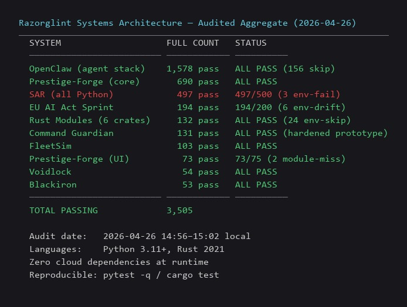
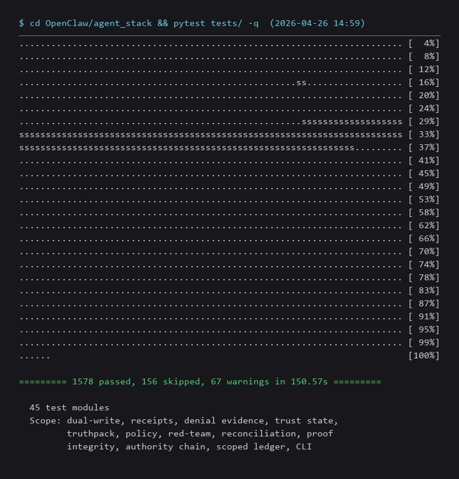
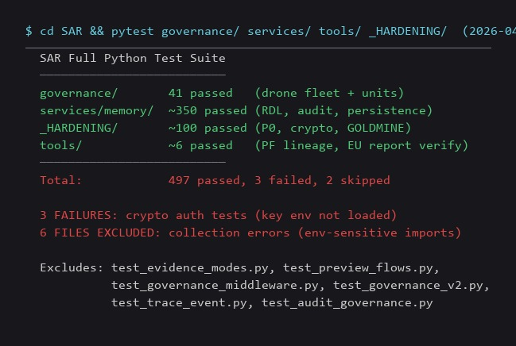
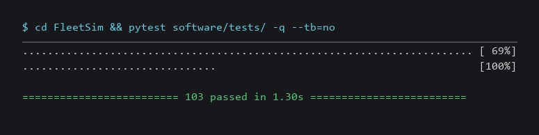
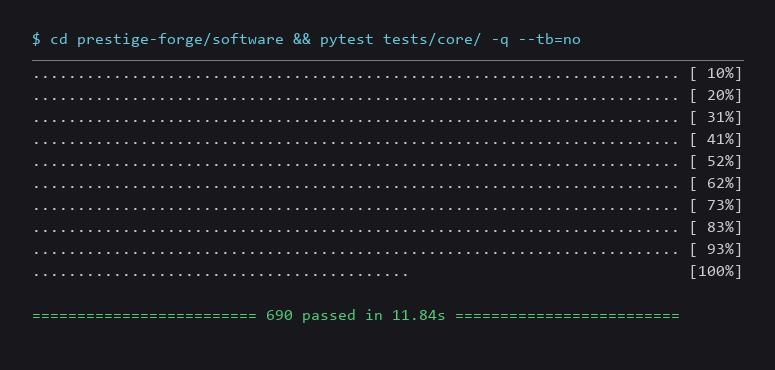
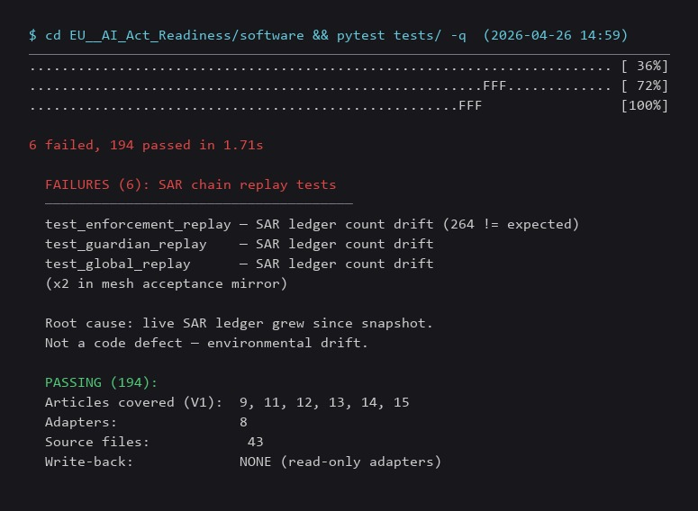
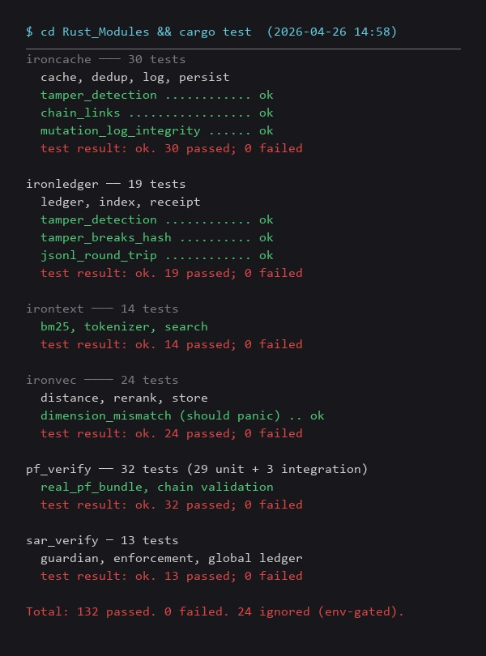
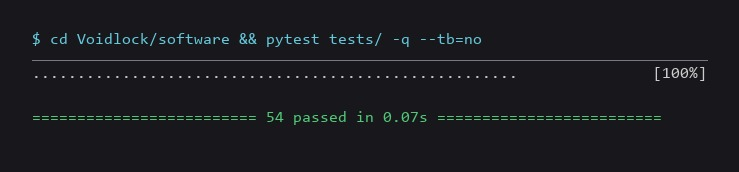
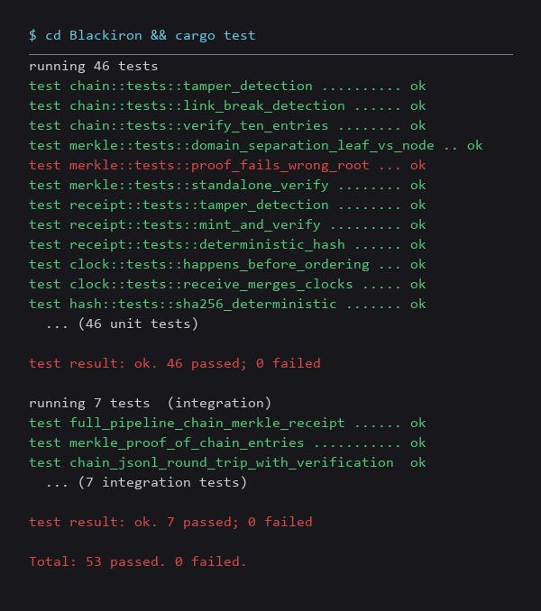
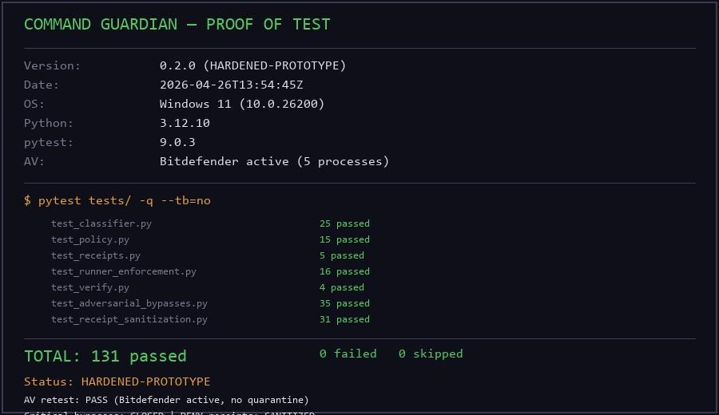

<h1 align="center">Razorglint Systems Architecture</h1>

<p align="center">
  <strong>15 systems. 3,400+ verified tests. Zero trust assumptions.</strong><br>
  <em>Every claim has a hash. Every action has a receipt. Every system proves itself or gets denied.</em>
</p>

<p align="center">
  
  
  
  
  
  
  
</p>

---

## The Short Version

Most automation platforms tell you they're safe. These ones **prove it cryptographically** — or they refuse to run.

This is the architecture map for the Razorglint Labs system portfolio. Not a concept deck. Not a roadmap. **Shipped infrastructure** across governance enforcement, cryptographic verification, AI reasoning orchestration, regulatory evidence compilation, and zero-trust execution — all independently operable, all producing tamper-evident proof chains.

This work started from a simple question: what if systems had to prove what they did instead of asking you to trust them?

**Damian Ketting** · Founder, Razorglint Labs

> **In this architecture, an action without proof is treated as if it never happened.**

---

## Proof at a Glance

These are not targets. These are **live test results from shipped code**.

| Metric | Count | Source |
|--------|-------|--------|
| Independent systems | **15** | This repository |
| Verified tests (Python + Rust) | **3,505** | Aggregate across all system test suites (2026-04-26) |
| OpenClaw governed agent tests | **1,578** passed, 156 skipped | 45 test modules, dual-write + policy + trust + truthpack |
| Prestige-Forge proof engine tests | **690** core | 15 constitutional families, 19 core modules |
| SAR governance tests | **497** Python + **13** Rust verification | 86 inventoried endpoints, fail-closed |
| EU AI Act evidence compiler tests | **194** (147 excluding env-sensitive chain replay) | 6 EU AI Act articles, 43 source files |
| Rust infrastructure crate tests | **132** across 6 crates | ironcache, ironledger, ironvec, irontext, pf_verify, sar_verify |
| FleetSim fleet governance tests | **103** | Trust plane, severity ladder, transition receipts |
| Command Guardian enforcement tests | **131** | Hardened prototype; 35 adversarial bypass tests + DENY receipt sanitization |
| Voidlock execution cage modules | **8** core + CLI | stdlib-only, deny-by-default |
| Blackiron cryptographic modules | **5** (hash, chain, merkle, clock, receipt) | Rust, domain-separated, deterministic |

Every number above can be reproduced by running `pytest` or `cargo test` in the corresponding repository. No marketing math.

---

## Verify It Yourself (2 minutes)

```bash
git clone https://github.com/RazorglintLabs/<REPO>
cd <REPO>
pytest -q
# or
cargo test
```

Expected:
- 3,400+ tests passing
- Fail-closed behavior on invalid policy
- Receipt chain verification OK

No complex setup required beyond Python 3.11+ or Rust 2021.

---

## What This Architecture Does That Yours Doesn't

```
YOUR SYSTEM                              RAZORGLINT SYSTEM
─────────────────────────────────────    ─────────────────────────────────────
"We log everything"                      Every event hash-chained. Tamper = detected.
"AI-powered decisions"                   AI recommends. Governance decides. Separate systems.
"Role-based access control"              Deny-by-default capabilities. No action without grant.
"Audit trail included"                   Receipt chains. Independent verification. No trust required.
"Compliant with regulations"             Article-mapped evidence packs. Gaps identified, not hidden.
"We take security seriously"             Fail-closed. Invalid state = hard stop. No override exists.
```

---

## Start Here

If you're new to this architecture, begin with:

- **SAR** → governance (enforces rules, fail-closed)
- **Prestige-Forge** → proof engine (verifies claims with evidence)
- **Voidlock** → execution cage (runs untrusted code safely)

Everything else extends or supports these three systems.

---

## System Inventory

Every system below is **sovereign** — independently deployable, independently testable, independently sellable. No shared runtime. No shared core. Integration happens through schemas and file contracts, never through imported internals.

---

### SAR — Safety Automation Readiness

**Runtime governance that doesn't ask permission — it enforces.**

```
Command In ──► Policy Gate ──► Ed25519 Signed Receipt ──► Append-Only Chain
                  │                                            │
             DENY if invalid                          Tamper breaks chain
             No override exists                       Detectable by any verifier
```

- 170 Python tests. 100 Rust tests. 21 cross-verification tests across 5 tamper classes and 390 records.
- 86 inventoried endpoints across 3 services.
- 10 approved claims — each backed by test evidence. 29-claim universe tracked. Forbidden claims documented and enforced.
- Drone fleet governance demo: **29/29 PASS** — 3 drone units, 1 fleet, 1 project, real policy enforcement.

SAR is intentionally non-AI. Deterministic. Predictable. The system that approves the operation is **never** the system that runs the operation.

---

### Prestige-Forge — Proof Verification Engine

**Turns intent into cryptographic proof. Not assertions — SHA-256 verified artifacts.**

- 690 core tests. 15 constitutional families. 19 core modules. All families closed.
- Client Zero proof: **25/25 PASS, 15/15 SAFE TO SAY** — real verification against real claims.
- Claims Safety Engine: every marketing statement validated against evidence before it can be published. Unsafe claim = blocked.
- Proof workflow: vault → receipt lineage → run engine → gate execution → evidence → proof mint → manifest → bundle. Each step produces verifiable output or the chain stops.
- stdlib-only Python. No frameworks in the proof path. Reproducible on any machine with Python 3.11+.

---

### Voidlock — Zero-Trust Execution Cage

**Untrusted code runs inside a cryptographically governed void. It cannot escalate. It cannot escape. It cannot lie about what happened.**

```
Capability (deny-by-default) → Budget (monotonic ↓) → Chain (append-only)
         └─────────────── Void (sealed cage) ──────────────┘
                              ↓ collapse
                        VoidReceipt (SHA-256, self-verifying)
                              ↓
                        VoidJudge (stateless)
                              ↓
                        PASS | FAIL | BREACH | PANIC | VOID | TIMEOUT
```

- 8 core modules. stdlib-only Python. No external dependencies in the execution path.
- Budgets only decrease. Capabilities only attenuate. Collapsed voids never reopen.
- The judge is stateless. Same inputs, same verdict. Every time.

---

### Blackiron — Cryptographic Primitives

**Hash chains, Merkle trees, hybrid logical clocks, tamper-evident receipts. Rust. Minimal dependencies. Deterministic.**

- 5 core modules. 4 crate dependencies (sha2, hex, serde, serde_json). Nothing else.
- Domain-separated Merkle prefixes prevent second-preimage attacks.
- Stable preimage formats documented for cross-language verification.
- Same inputs = same outputs. Always.

---

### Rust Modules — Infrastructure Crates

**Purpose-built Rust crates for governed systems.**

- **ironcache** — deterministic caching with eviction control (30 tests)
- **ironledger** — append-only ledger primitives (19 tests)
- **ironvec** — vector operations for embedding pipelines (24 tests)
- **irontext** — text processing for structured extraction (14 tests)

132 tests across 6 crates. All passing. All stdlib + minimal deps.

---

### EU AI Act Evidence Readiness Sprint

**Read-only evidence compiler mapped to EU AI Act Articles 9, 11, 12, 13, 14, 15.**

- 43 source files. 8 adapters. 194 tests (147 excluding env-sensitive SAR chain replay).
- Consumes sealed outputs from Prestige-Forge, SAR, ReasonForge, PolicySourceEngine, and ChessClock through read-only adapters.
- Produces article-mapped evidence packs, gap registers, and compliance readiness reports.
- **Never writes back** into any source system. Data flows one direction: sovereign → adapter → report → customer.
- Does not say "compliant." Says "here is the evidence, here are the gaps, here is the mapping." The auditor decides.

---

### CTLM — Controlled Thinking Layer Model

**AI reasoning that knows its place.**

- Multi-phase structured reasoning: warm-up → main → verification → diagnostics.
- Vector-based semantic retrieval over embedded knowledge (384-dimensional space, FAISS-backed).
- The AI layer generates recommendations. It never executes. Governance and execution are separate systems with separate authority chains.
- Every reasoning step logged. Every decision auditable. No freeform generation reaches production without structured validation.

---

### OpenClaw — Governed Autonomous Agents

**Autonomous agent team running under SAR enforcement. Every agent action receipted. Every output exportable as a Truthpack.**

- 1,578 tests passing. 45 test modules covering dual-write, policy, trust, denial, truthpack, red-team, and reconciliation.
- Dual-write receipt chain model — agents produce evidence, SAR enforces policy.
- Three-lane architecture: upstream (read-only, pinned), agent stack (Razorglint wrapper), docs (frozen).
- No agent defines its own rules. No agent bypasses governance. No output without a receipt.

---

### Truthpack Growth Engine

**Proof-gated content distribution. No evidence, no publish.**

- 9 bounded agents with single-owner task routing. No agent overlap. No shared state.
- Every claim linked to a specific SHA-256 proof artifact. Stale evidence (>24h) blocks all downstream output.
- Human approval gate mandatory. No automated publishing without operator sign-off.

---

### CalledIt — Verifiable Prediction Sealing

**Lock a prediction with AES-256-GCM at creation time. Reveal on schedule. Prove you didn't cheat.**

- Per-seal random keys. Encrypted at rest. Decrypted on schedule.
- Anonymous verification — no identity required to prove prediction accuracy.
- Cross-platform: PWA + native wrappers (Android/Capacitor, Windows/Tauri).

---

### Command Guardian

**Hardened local-first command enforcement prototype. Blocks risky terminal commands, emits hash-chained audit receipts, and sanitizes denied command evidence safely.**

- Current audit: **131/131 tests passing** after emergency security remediation.
- Critical bypass classes closed with adversarial tests.
- DENY receipts store command hashes instead of raw dangerous command strings.
- Token issuance is now audit-receipted.
- Version corrected to **0.2.0-security-hardening**; earlier `v1.0.0` release marked superseded.
- Not production-ready, not certified, not SAR-integrated, and receipt signing remains deferred.

---

### FleetSim — Fleet Trust Plane

**Heartbeat and distress-pulse mechanism for fleet-scale governance.**

- 103 tests passing. Trust plane enforcement, severity ladder, transition receipts, outage handling.
- Fleet Reflex Loop: routine heartbeat → distress pulse → reflex receipt.
- Calibration framework with coefficient-of-variation analysis and provisional candidate detection.

---

## Architecture

Authority flows down. Evidence flows up. **No system defines its own rules.**

```
┌──────────────────────────────────────────────────────────────────┐
│  OPERATOR                                                        │
│  Cockpits · CLI · Approval Gates · Human Override                │
├──────────────────────────────────────────────────────────────────┤
│  GOVERNANCE                          SAR Policy Enforcement      │
│  Ed25519 signed doctrine ──► Fail-closed gate ──► Receipt chain  │
├──────────────────────────────────────────────────────────────────┤
│  VERIFICATION                        Cryptographic Proof Layer   │
│  Prestige-Forge · Blackiron · Voidlock · Hash Chains · Merkle   │
├──────────────────────────────────────────────────────────────────┤
│  EXECUTION                           Governed Runtime            │
│  OpenClaw Agents · Truthpack · CalledIt · FleetSim              │
├──────────────────────────────────────────────────────────────────┤
│  REASONING                           Controlled AI               │
│  CTLM · ReasonForge · Structured Retrieval                       │
├──────────────────────────────────────────────────────────────────┤
│  COMPLIANCE                          Evidence Compilation         │
│  EU AI Act Sprint · Article Mapping · Gap Register               │
└──────────────────────────────────────────────────────────────────┘
```

Integration between systems happens through **schemas, file contracts, and sealed outputs** — never through shared runtimes or imported internals. Every sovereign asset remains independently operable, licensable, and sellable.

---

## Design Law

These are not aspirations. These are **enforced constraints** with hard-stop triggers.

| Principle | Enforcement |
|-----------|-------------|
| **Separation of authority** | The system that runs the operation never approves the operation. Governance and execution are architecturally separated. |
| **Fail-closed** | Invalid policy, stale proof, broken chain = hard stop. Not a warning. Not a retry. A stop. |
| **Deterministic control** | Same inputs produce same outputs. No probabilistic safety. Operators can predict behavior. |
| **Local-first** | No cloud dependency at runtime. No external infrastructure for core functions. Operator owns the data. |
| **Deny-by-default** | No capability granted unless explicitly authorized. Attenuation only — children never get more than parents. |
| **No shared core** | No `common/`, no `shared_engine/`, no central runtime across systems. Sovereign boundaries are architectural, not organizational. |
| **Append-only records** | Hash-chained. Signed. Tampering is detectable by any independent verifier. |

---

## Stack

| Layer | Technology |
|-------|-----------|
| **Languages** | Python 3.11+, Rust 2021, TypeScript, PowerShell |
| **Frameworks** | FastAPI (API surfaces), Flask/Jinja (local UI), React, Electron |
| **Cryptography** | SHA-256 hash chains, Ed25519 digital signatures, AES-256-GCM sealed payloads |
| **Storage** | SQLite, append-only JSONL ledgers, file-based sealed bundles |
| **AI / Retrieval** | FAISS, sentence-transformers (384-dim), structured multi-phase reasoning |
| **Infrastructure** | Docker, local-first by default, no mandatory cloud services |

---

## For Buyers and Decision-Makers

**What you get:** Systems that produce cryptographic evidence of their own behavior — not compliance theater, not checkbox security, not "trust us" documentation.

**What that means:**
- Your automation can prove what it did, when, and under what authority.
- Your AI systems reason inside governed boundaries — they recommend, they don't execute.
- Your regulatory evidence is compiled from sealed artifacts — article-mapped, gap-identified, auditor-ready.
- Your operational logs are tamper-evident. Alteration is mathematically detectable.

**What it doesn't mean:**
- This is not "AI compliance in a box." It maps evidence to articles and tells you where the gaps are.
- This is not a SaaS platform. It runs on your infrastructure, under your control.
- This does not say "certified" or "compliant." It says "here is the proof — you decide."

---

## Proof Snapshots

Live test output captured under real conditions. Not mockups.












---

## About

**Razorglint Labs** builds governance infrastructure and verification systems for organizations that need their automation to **prove its behavior**, not just assert it.

Independent systems engineering. Cryptographic evidence. Operator authority preserved.

**Damian Ketting** — Founder  
**Contact:** razorglint.ops@protonmail.com  
**GitHub:** [@RazorglintLabs](https://github.com/RazorglintLabs)

---

<p align="center"><sub>Razorglint Labs — TCOG Collective LLC · All rights reserved</sub></p>
